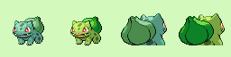
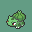

# mon-gfx

This project will build two tools (```monsprite``` & ```monicon```) for compiling Pokémon sprites for use with GBA [decompilation projects](https://github.com/pret).
The purpose of this project is to automatically arrange sprite palettes, redraw the sprites using the properly formatted palettes, then compress and export the data as binary files to be included in a project.

> Note: The outputted data is not compatable with standard decompilation projects (like pokeeemerald) by default. These tools were written for the development of Pokémon Saffron Version, which handles battler sprite and icon sprite data in a different fashion. For example, battler sprite palette binaries are uncompressed data, unlike in pokeemerald where the palette data is Lz77 compressed. Another example being that icon sprites use unique palettes, unlike in pokeemerald where icons use a standardized set of palettes.

## monsprite



This tool takes a standard indexed 256x64 battler gfx spritesheet (example above) as an input and outputs binary files with the Lz77 compressed front+back sprite tile data, the standard+shiny palette data, and a header file with the relevant declarations and defines for sprite dimensions used by battler coordinate functions.
> Note: The indexed palettes do **not** need to retain a specific order (e.g. the transparent color being in the first position, or the standard and shiny palettes being seperated).

For example, executing ```monsprite bulbasaur_sprite.png bulbasaur``` will output the following files.
- /bulbasaur.front.4bpp
- /bulbasaur.back.4bpp
- /bulbasaur.front.pal
- /bulbasaur.back.pal
- /bulbasaur.h

## monicon



This tool takes indexed 32x32 icon gfx (example above) as an input and outputs binary files with the tile+palette data.
> Note: The indexed palettes do **not** need to retain a specific order (e.g. the transparent color being in the first position).

For example, executing ```monicon bulbasaur_icon.png bulbasaur``` will output the following files.
- /bulbasaur.icon.4bpp
- /bulbasaur.icon.pal

## Including the outputted data

The binary files can then be included in an assembly file anywhere in the project.
```as
front_tiles_bulbasaur:: .incbin "bulbasaur.front.4bpp"
back_tiles_bulbasaur:: .incbin "bulbasaur.back.4bpp"
front_pal_bulbasaur:: .incbin "bulbasaur.front.pal"
back_pal_bulbasaur:: .incbin "bulbasaur.back.pal"
icon_tiles_bulbasaur:: .incbin "bulbasaur.icon.4bpp"
icon_pal_bulbasaur:: .incbin "bulbasaur.icon.pal"
```

All necessary declarations are in the outputted header file to be included in your gfx data structure, as well as sprite coord data.
```c
#include "bulbasaur.h"

const struct SpeciesGfx gSpeciesGfxTable[] =
{
    [SPECIES_BULBASAUR] =
    {
        .frontTiles = {front_tiles_bulbasaur, MON_PIC_SIZE, SPECIES_BULBASAUR + GFX_TAG_SPECIES},
        .backTiles = {back_tiles_bulbasaur, MON_PIC_SIZE, SPECIES_BULBASAUR + GFX_TAG_SPECIES},
        .iconTiles = {icon_tiles_bulbasaur, (32 * 32) / 2},
        .frontPal = {front_tiles_bulbasaur, SPECIES_BULBASAUR + GFX_TAG_SPECIES},
        .backPal = {front_tiles_bulbasaur, SPECIES_BULBASAUR + GFX_TAG_SPECIES_SHINY},
        .iconPal = {icon_pal_bulbasaur, SPECIES_BULBASAUR + GFX_TAG_SPECIES_ICON},
        .frontCoords = { .size = MON_COORDS_SIZE(bulbasaur_f_w, bulbasaur_f_h), .y_offset =  0 },
        .backCoords = { .size = MON_COORDS_SIZE(bulbasaur_b_w, bulbasaur_b_h), .y_offset =  0 },
        .elevation = 0,
    },
    ...
};
```
